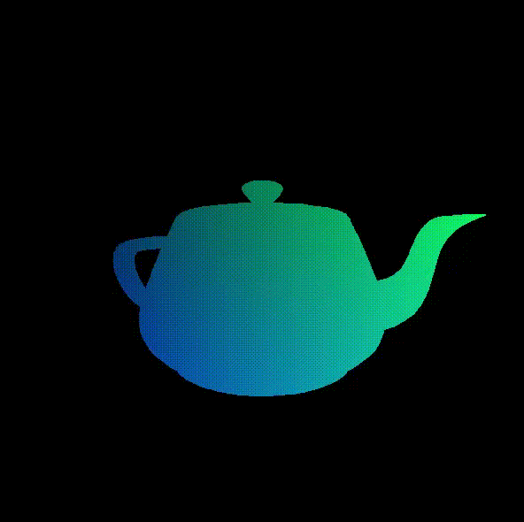
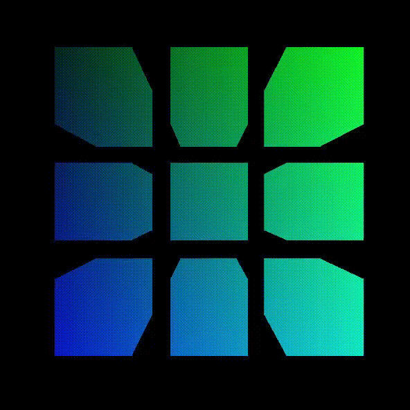
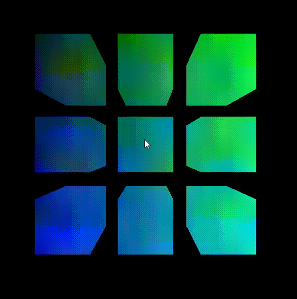

# Renderizador 3D por Software

Implementación de un renderizador 3D escrito en C utilizando SDL2, desarrollado con fines educativos para explorar los fundamentos de la computación gráfica y el funcionamiento interno de un pipeline gráfico moderno sin depender de OpenGL, DirectX o motores externos.

## Tecnologías

- C
- SDL2

## Conceptos Implementados

### Pipeline Gráfico

El proyecto implementa manualmente las etapas fundamentales de un pipeline de renderizado:

1. Transformación de vértices (rotación por ejes X, Y, Z + traslación al espacio mundo).
2. Transformación al espacio de cámara (view matrix manual con vectores adelante/derecha/arriba).
3. Clipping geométrico contra el near plane en espacio de cámara.
4. Proyección perspectiva.
5. Conversión a coordenadas de pantalla.
6. Rasterización de primitivas con coordenadas baricéntricas.

### Computación Gráfica

- Álgebra lineal aplicada a gráficos.
- Transformaciones tridimensionales (matrices de rotación por ejes).
- Sistemas de coordenadas (mundo, cámara, pantalla).
- Back-face culling por signo del área del triángulo proyectado.
- Clipping de polígonos contra el near plane (casos 0, 1 y 2 vértices afuera).
- Z-buffer con interpolación perspectiva correcta usando coordenadas baricéntricas.
- Cámara libre con rotación mediante fórmula de Rodrigues.
- Carga y parseo de modelos `.obj` (formatos `v/vt/vn`, `v//vn` y `v`).
- Renderizado completamente por software, píxel a píxel.

## Estructura del Proyecto

```
├── main.c          — Loop principal, entrada SDL2
├── render.c        — Pipeline completo: transformación, clipping, proyección, rasterización, cámara
├── render.h        — Tipos y declaraciones (punto3D_t, poligono3D_t, camara_t, modelo_t...)
├── parser.c        — Carga de archivos .obj desde la carpeta /modelos
├── parser.h
└── modelos/        — Modelos .obj a renderizar
```

## Controles

### Cámara

| Tecla / Input | Acción |
|---|---|
| W / S | Avanzar / Retroceder |
| A / D | Moverse lateralmente |
| Space / Shift | Subir / Bajar |
| Click + arrastrar | Rotar cámara (mouse look libre 360°) |

### Modelos

| Tecla | Acción |
|---|---|
| Q / E | Seleccionar modelo anterior / siguiente |
| R / Y | Mover modelo adelante / atrás |
| F / H | Mover modelo izquierda / derecha |
| T / G | Mover modelo arriba / abajo |
| I / K | Rotar modelo en X |
| J / L | Rotar modelo en Y |
| U / O | Rotar modelo en Z |

## Capturas







## Estado Actual

- [x] Transformaciones 3D (rotación por los tres ejes, traslación)
- [x] Proyección en perspectiva
- [x] Clipping contra el near plane (casos 0/1/2 vértices)
- [x] Rasterización de triángulos con coordenadas baricéntricas
- [x] Z-Buffer con corrección de perspectiva
- [x] Back-face culling
- [x] Carga de modelos `.obj`
- [x] Cámara libre (rotación 360° sin gimbal lock, via Rodrigues)
- [x] Soporte para múltiples modelos simultáneos
- [x] Frustum culling por bounding box

## Próximos Pasos

- [ ] Iluminación difusa (Lambert)
- [ ] Iluminación especular (Phong)
- [ ] Texturas UV
- [ ] Top-left fill rule (artefactos en bordes compartidos)
- [ ] Frustum clipping completo (planos arriba/abajo/izquierda/derecha)
- [ ] Soporte de quads en el parser `.obj`
- [ ] Optimizaciones de rendimiento

## Aprendizajes

Durante el desarrollo de este proyecto se trabajó con:

- Programación de bajo nivel en C.
- Manejo manual de memoria (`malloc`, `free`, aritmética de punteros).
- Estructuras matemáticas para gráficos 3D (vectores, productos cruz y punto, rotaciones).
- Algoritmos de clipping geométrico.
- Interpolación baricéntrica y corrección de perspectiva en el z-buffer.
- Rotación de cámara libre mediante la fórmula de Rodrigues (sin gimbal lock).
- Parseo de archivos `.obj` y manejo de múltiples formatos de cara.
- Arquitectura modular de un renderizador por software.